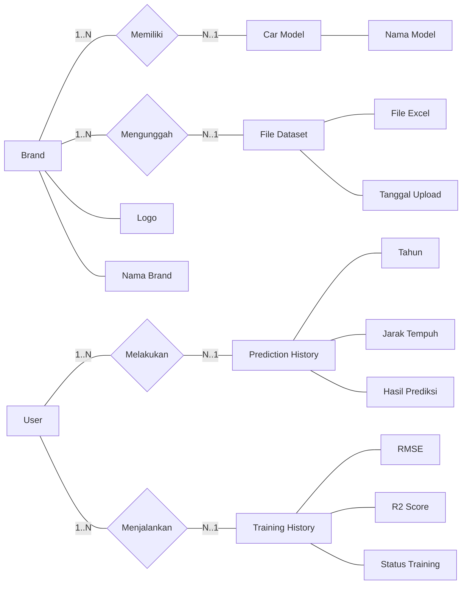
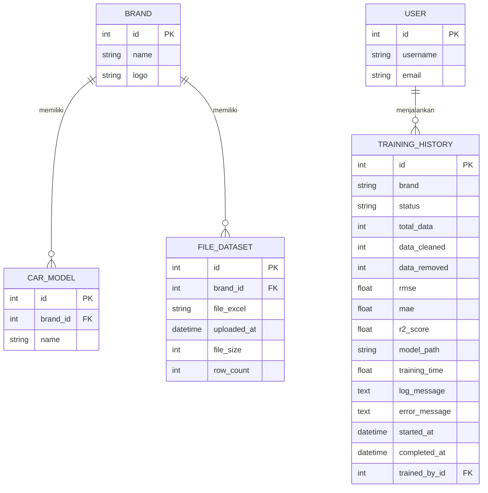
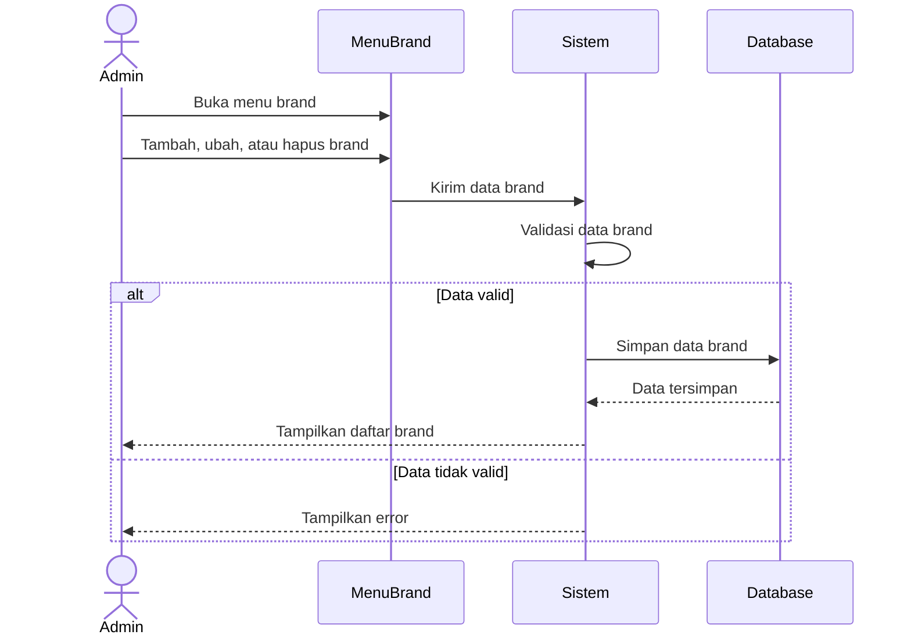
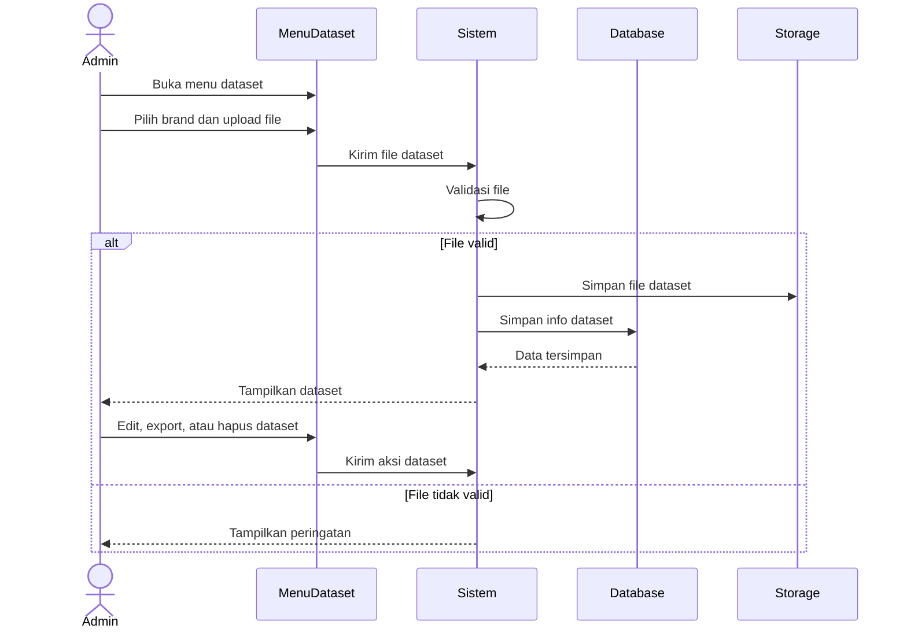
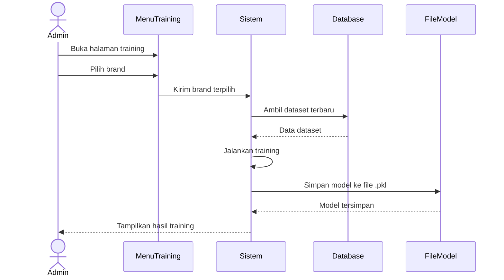
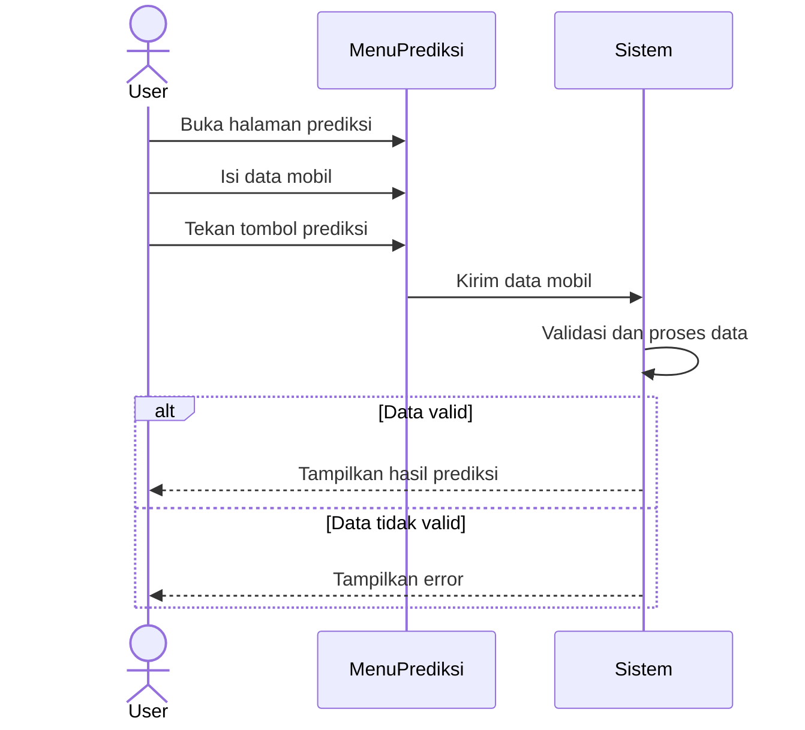

# Catatan Use Case Sistem Prediksi Harga Mobil Bekas

## Ringkasan Aktor dan Akses

| Aktor | Deskripsi | Fitur yang Bisa Diakses |
|---|---|---|
| User | Pengguna sistem yang melakukan prediksi harga mobil | Prediksi harga mobil |
| Admin | Pengelola data dan model pada sistem | Kelola brand, kelola dataset, dan training model |

## Skenario Use Case

### 1. Prediksi Harga Mobil

| Identifikasi | Deskripsi |
|---|---|
| Nama | Prediksi Harga Mobil |
| Tujuan | User mendapatkan estimasi harga mobil bekas berdasarkan data yang dipilih |
| Deskripsi | Halaman yang menyediakan form untuk memilih brand, model, tahun, jarak tempuh, transmisi, bahan bakar, dan kapasitas mesin, lalu menampilkan hasil prediksi harga beserta rentang harga. |
| Aktor | User |
| Kondisi Awal | User membuka sistem dan masuk ke halaman prediksi |
| Skenario Utama | 1. User membuka halaman prediksi. 2. User memilih brand, model, tahun, jarak tempuh, transmisi, bahan bakar, dan kapasitas mesin. 3. User menekan tombol prediksi. 4. Sistem memvalidasi input dan memproses data. 5. Sistem menampilkan hasil estimasi harga mobil beserta rentang harga minimum dan maksimum. |
| Skenario Alternatif | 1. Jika data belum lengkap, sistem menampilkan pesan validasi. 2. Jika format angka tidak valid, sistem menampilkan pesan error. 3. Jika proses prediksi gagal, sistem menampilkan pesan kesalahan. |
| Kondisi Akhir | User memperoleh informasi estimasi harga mobil bekas yang dipilih |

### 2. Kelola Brand Mobil

| Identifikasi | Deskripsi |
|---|---|
| Nama | Kelola Brand Mobil |
| Tujuan | Memungkinkan admin untuk menambah, mengubah, dan menghapus brand mobil |
| Deskripsi | Halaman admin menyediakan daftar brand mobil dan form untuk mengelola data brand. Admin juga dapat mengelola model mobil yang terkait dengan brand tersebut. |
| Aktor | Admin |
| Kondisi Awal | Admin membuka halaman admin brand |
| Skenario Utama | 1. Admin membuka menu brand. 2. Admin menambah, mengubah, atau menghapus brand mobil. 3. Sistem menyimpan perubahan data brand. 4. Sistem menampilkan daftar brand yang sudah diperbarui. |
| Skenario Alternatif | 1. Jika data brand sudah ada, sistem menolak duplikasi. 2. Jika proses simpan gagal, sistem menampilkan pesan error. |
| Kondisi Akhir | Data brand mobil tersimpan dan tampil sesuai perubahan |

### 3. Kelola Dataset Mobil

| Identifikasi | Deskripsi |
|---|---|
| Nama | Kelola Dataset Mobil |
| Tujuan | Memungkinkan admin untuk mengunggah, mengubah, mengekspor, dan menghapus dataset per brand |
| Deskripsi | Admin mengunggah file dataset mobil bekas untuk tiap brand. Sistem membaca file, menghitung jumlah baris data, dan menyediakan tombol edit, export, serta delete pada masing-masing dataset. |
| Aktor | Admin |
| Kondisi Awal | Admin membuka halaman pengelolaan dataset |
| Skenario Utama | 1. Admin memilih brand. 2. Admin mengunggah file dataset. 3. Sistem menyimpan file dan menghitung jumlah baris data. 4. Admin dapat mengubah, mengekspor, atau menghapus dataset yang tersedia. |
| Skenario Alternatif | 1. Jika file tidak valid, sistem menampilkan pesan error. 2. Jika file gagal dibaca, sistem menampilkan peringatan. 3. Jika dataset tidak ditemukan, sistem menampilkan notifikasi. |
| Kondisi Akhir | Dataset mobil tersimpan, dapat diekspor, atau dihapus sesuai tindakan admin |

### 4. Training Model

| Identifikasi | Deskripsi |
|---|---|
| Nama | Training Model |
| Tujuan | Memungkinkan admin untuk melatih model prediksi berdasarkan dataset yang tersedia |
| Deskripsi | Admin memilih brand yang memiliki dataset, lalu sistem menjalankan proses training model machine learning dan menampilkan hasil metrik training seperti RMSE dan R² Score. |
| Aktor | Admin |
| Kondisi Awal | Admin membuka halaman training model |
| Skenario Utama | 1. Admin memilih brand yang akan dilatih. 2. Sistem mengambil dataset terbaru untuk brand tersebut. 3. Sistem menjalankan proses training model. 4. Sistem menampilkan hasil training dan metrik performa model. |
| Skenario Alternatif | 1. Jika dataset tidak tersedia, sistem menampilkan pesan bahwa data belum ada. 2. Jika proses training gagal, sistem menampilkan pesan error. |
| Kondisi Akhir | Model berhasil dilatih dan hasil training tersedia |

### 5. Dashboard Admin

| Identifikasi | Deskripsi |
|---|---|
| Nama | Dashboard Admin |
| Tujuan | Admin mengelola sistem prediksi harga mobil bekas (Pregamo) |
| Deskripsi | Halaman yang menyediakan akses untuk pengelolaan dataset, brand kendaraan, dan proses training model. |
| Aktor | Admin |
| Kondisi Awal | Admin login ke sistem |
| Skenario Utama | 1. Admin login ke dashboard. 2. Sistem menampilkan menu utama admin dengan 3 fungsi utama: a) Mengelola dataset. b) Melatih dan memperbarui model. c) Mengelola brand kendaraan. |
| Skenario Alternatif | 1. Jika login gagal, sistem menampilkan pesan error. 2. Jika proses training gagal, sistem menampilkan pesan error dan log. |
| Kondisi Akhir | Admin berhasil mengakses dashboard dan mengelola dataset, brand kendaraan, serta proses training model |

## Catatan Singkat

| Keterangan | Isi |
|---|---|
| Login | Tidak dimasukkan sebagai use case karena dianggap sebagai prasyarat akses, bukan fitur utama sistem |
| User | Mengakses fitur prediksi harga mobil |
| Admin | Mengakses fitur pengelolaan brand, dataset, dan training model |

## Diagram ERD

Berikut dua bentuk visual ERD untuk basis data yang digunakan pada sistem: gaya Chen yang mirip dengan gambar referensi, dan versi relasi crow's foot untuk dokumentasi teknis.

Jika ingin bentuk visual yang lebih mirip dengan gambar yang Anda buat, ERD-nya bisa ditampilkan dengan gaya Chen seperti sketsa berikut:

### Penjelasan Relasi ERD

| Relasi | Keterangan |
|---|---|
| `Brand` ke `CarModel` | Satu brand dapat memiliki banyak model mobil |
| `Brand` ke `FileDataset` | Satu brand dapat memiliki banyak file dataset |
| `User` ke `TrainingHistory` | Satu user dapat menjalankan banyak proses training |

### Detail Rancangan Tabel Basis Data

| Tabel | Primary Key | Foreign Key | Keterangan Singkat |
|---|---|---|---|
| `brand` | `id` | - | Menyimpan data merek mobil |
| `car_model` | `id` | `brand_id` | Menyimpan model mobil per brand |
| `file_dataset` | `id` | `brand_id` | Menyimpan file dataset per brand |
| `training_history` | `id` | `trained_by_id` | Menyimpan riwayat training model |

Catatan: model `CarDataset` masih ada di kode sebagai model legacy/deprecated, tetapi workflow aktif yang dipakai sistem sekarang adalah `FileDataset` dan `TrainingHistory`.

## Activity Flow

| Keterangan | Isi |
|---|---|
| Swimlane | Activity diagram menggunakan 3 lane utama: Admin/User, Sistem, dan Database |
| Catatan | Admin/User melakukan aksi, Sistem memproses permintaan, dan Database menyimpan atau mengambil data. Training model memakai database, sedangkan prediksi tidak memakai database pada alur aktif saat ini |

### 1. Mengolah Data Brand Mobil

| Tahap | Aktivitas |
|---|---|
| Mulai | Admin buka menu brand |
| Aktivitas 1 | Admin tambah, ubah, atau hapus brand |
| Aktivitas 2 | Sistem validasi data brand |
| Aktivitas 3 | Sistem simpan ke database |
| Aktivitas 4 | Database simpan data brand |
| Aktivitas 5 | Sistem tampilkan daftar brand |
| Alternatif | Jika data duplikat atau simpan gagal, sistem tampilkan error |
| Selesai | Data brand berhasil dikelola |

### 2. Mengolah Dataset Mobil

| Tahap | Aktivitas |
|---|---|
| Mulai | Admin buka menu dataset |
| Aktivitas 1 | Admin pilih brand dan upload file |
| Aktivitas 2 | Sistem simpan file dan data ke database |
| Aktivitas 3 | Database simpan info dataset |
| Aktivitas 4 | Sistem hitung jumlah data |
| Aktivitas 5 | Admin edit, export, atau hapus dataset |
| Alternatif | Jika file tidak valid atau data tidak ditemukan, sistem tampilkan peringatan |
| Selesai | Dataset berhasil dikelola |

### 3. Melatih dan Memperbarui Model

| Tahap | Aktivitas |
|---|---|
| Mulai | Admin buka halaman training |
| Aktivitas 1 | Admin pilih brand |
| Aktivitas 2 | Sistem ambil dataset terbaru dari database |
| Aktivitas 3 | Database kirim data dataset |
| Aktivitas 4 | Sistem jalankan training |
| Aktivitas 5 | Sistem tampilkan hasil training |
| Alternatif | Jika dataset tidak ada di database atau training gagal, sistem tampilkan error |
| Selesai | Model berhasil diperbarui |

### 4. Melakukan Prediksi Harga Mobil Bekas

| Tahap | Aktivitas |
|---|---|
| Mulai | User buka halaman prediksi |
| Aktivitas 1 | User isi data mobil |
| Aktivitas 2 | User tekan tombol prediksi |
| Aktivitas 3 | Sistem validasi dan proses data |
| Aktivitas 4 | Sistem tampilkan hasil prediksi |
| Alternatif | Jika data tidak lengkap atau proses gagal, sistem tampilkan error |
| Selesai | User dapat estimasi harga mobil |

## Sequence Diagram

### 1. Sequence Diagram Mengolah Data Brand Mobil

### 2. Sequence Diagram Mengolah Dataset Mobil

### 3. Sequence Diagram Melatih dan Memperbarui Model

### 4. Sequence Diagram Melakukan Prediksi Harga Mobil Bekas

